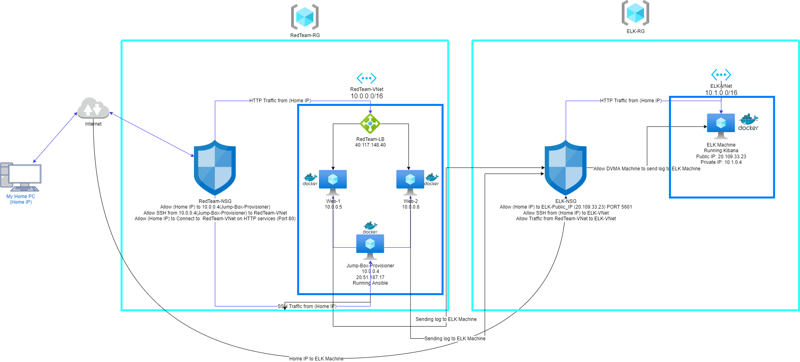
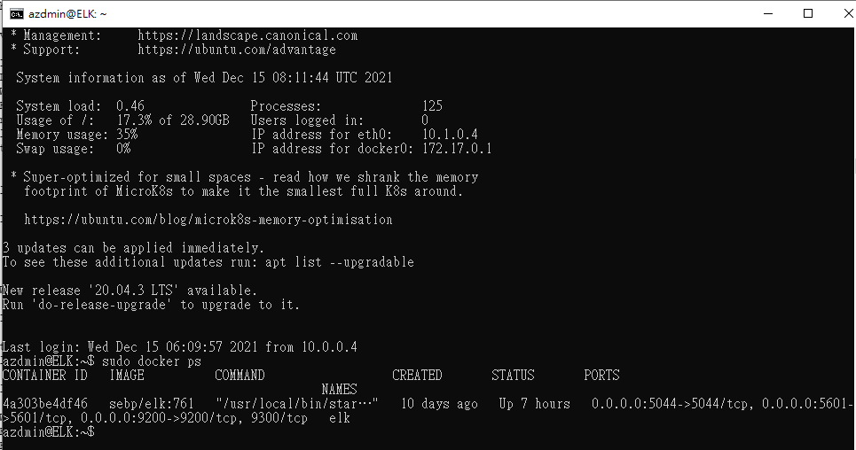

## Automated ELK Stack Deployment

The files in this repository were used to configure the network depicted below.

These files have been tested and used to generate a live ELK deployment on Azure. They can be used to either recreate the entire deployment pictured above. Alternatively, select portions of the Ansible file may be used to install only certain pieces of it, such as Filebeat.
The complete Ansible Playbooks are listed:
  - [Install DVWA](Ansible/pentest.yml)
  - [Install ELK](Ansible/install-elk.yml)
  - [Install FileBeat](Ansible/filebeat-playbook.yml)
  - [Install Metricbeat](Ansible/metricbeat-playbook.yml) 

This document contains the following details:
- Description of the Topologu
- Access Policies
- ELK Configuration
  - Beats in Use
  - Machines Being Monitored
- How to Use the Ansible Build

### Description of the Topology

The main purpose of this network is to expose a load-balanced and monitored instance of DVWA, the D*mn Vulnerable Web Application.

Load balancing ensures that the application will be highly available, in addition to restricting unwanted to the network.

Integrating an ELK server allows users to easily monitor the vulnerable VMs for changes to the File Systems and Machine Metrics.

The configuration details of each machine may be found below.

| Name     | Function | IP Address | Operating System |
|----------|----------|------------|------------------|
| Jump Box | Gateway  | 10.0.0.4   | Linux            |
| Web 1    | DVWA Web Server|10.0.0.5            |Linux                  |
| Web 2    |  DVWA Web Server        |10.0.0.6            |Linux                  |
| ELK     |ELK Server          |10.1.0.4            |Linux                  |

### Access Policies

The machines on the internal network are not exposed to the public Internet. 

Only the Jump Box machine can accept connections from the Internet. Access to this machine is only allowed from the following IP addresses:
(My Home IP Address that I do not wish to Reveal)

Machines within the network can only be accessed by Jump Box machine.
A summary of the access policies in place can be found in the table below.

| Name     | Publicly Accessible | Allowed IP Addresses |
|----------|---------------------|----------------------|
| Jump Box | No (Only from my Home IP)             | (My Home IP Address that I do not wish to Reveal)|
| Web Servers (Web 1 and 2)         | No (Only from Jump Box )                    | Jump Box(10.0.0.4)                     |
| ELK         | No (Only from my Home IP)                    |(My Home IP Address that I do not wish to Reveal)                      |

### Elk Configuration

Ansible was used to automate configuration of the ELK machine. No configuration was performed manually, which is advantageous because its easily scalable. 

The playbook implements the following tasks:
- Install Docker
- Install pip3
- Install Docker Python module
- Increase memory usage
- Download and launch a Docker ELK container
- Enable service Docker on boot

The following screenshot displays the result of running `docker ps` after successfully configuring the ELK instance.

### Target Machines & Beats
This ELK server is configured to monitor the following machines:
- Web Server 1 VM: 10.0.0.5
- Web Server 1 VM: 10.0.0.6

We have installed the following Beats on these machines:
- Filebeat and Metricsbeat

These Beats allow us to collect the following information from each machine:
- Filebeat tracks the data about the file system and Metricsbeat tracks machine metrics such as uptime.

### Using the Playbook
In order to use the playbook, you will need to have an Ansible control node already configured. Assuming you have such a control node provisioned: 

SSH into the control node and follow the steps below:
- Copy the Ansible Playbook file to /etc/ansible/.
- Update the hosts file to include target IP of the VMs you wish to provision.
- Update the ansible.cfg file to include the username the VMs you wish to provision.
- Update the *beat-config.yml file to include the proper IP address and username / password for the ELK Machine.
- Run the playbook, and navigate to Module status to check that the installation worked as expected.

Which URL do you navigate to in order to check that the ELK server is running?
- http://(ELKSERVERIP):5601

_As a **Bonus**, provide the specific commands the user will need to run to download the playbook, update the files, etc._

To Download the ansible playbook file just simply `git clone` this git repo and to update the file, simply `nano the *beat-config.yml`
